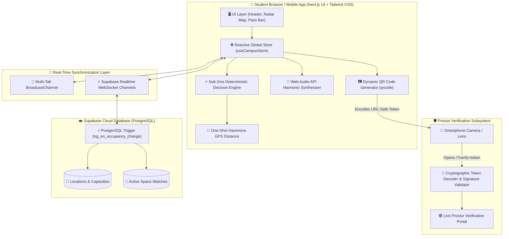

# Spotly — Real-Time Campus Space Decision Engine & Digital Pass Platform 🌿

> **"Google Maps tells you where a place is. Spotly tells you if it's worth going there right now."**  
> *Don't wait. Don't wander. Just know.*

[](https://spotly-steel.vercel.app/)
[](https://github.com/Noobi-Programmer/Spotly)
[](https://github.com/Noobi-Programmer/Spotly)
[](https://scaler.com)

---

## 🎯 1. Problem → Solution

### The Friction (The Campus Visibility & Squatting Gap)
Every day across university campuses, students waste **20–45 minutes wandering between floors and buildings** looking for an open desk with a charging plug, a quiet corner to take an interview, or an empty badminton court. Meanwhile:
1. **Campus maps are static 2D blueprints:** They show room walls, but are completely blind to live occupancy, noise level, and power outlet availability.
2. **Seat Squatting & Unauthorized Reserving:** Students put a water bottle or bag on a desk for hours while leaving the campus.
3. **No Proof of Reservation:** When students try to use study pods or sports facilities, there is no verifiable system to prove who has the desk right now.

### The Solution: Spotly
Spotly is the **real-time decision and digital boarding pass layer for physical campus spaces**:
* **Sub-2ms Decision Engine:** Aggregates live occupancy telemetry, acoustic noise levels, and power outlets into an instant deterministic matching algorithm with 100% explainable match scores.
* **Instant E-Ticket Boarding Passes:** Reserves designated desks (`Table 04 • Seat T4-S2`) with live ticking countdown timers.
* **Cryptographic QR Proctor Verification:** Scannable digital passes signed with tamper-proof cryptographic tokens that campus security and librarians can verify with any phone camera in 1 second.
* **Sports & Turf Locker Management:** Live court slot reservation (Turf 5v5, Badminton, Volleyball, TT) and locker gear tracking.
* **"Watch This Space" Real-Time Alerts:** Subscribes to full rooms and pings the student's device the exact millisecond occupancy clears.

---

## ✨ 2. Key Features & Superpowers

```
┌──────────────────────────────────────────────────────────────────────────────────┐
│                                SPOTLY ECOSYSTEM                                  │
├───────────────────────┬──────────────────────────┬───────────────────────────────┤
│   🧠 DECISION BRAIN   │    🎟️ DIGITAL PASSES     │     🛡️ PROCTOR SECURITY       │
│  • Sub-2ms Match Algo │   • Table & Seat Badges  │    • Real-Time QR Generator   │
│  • Acoustic Intent    │   • Live Expiration Bar  │    • Cryptographic Signatures │
│  • GPS Walking Time   │   • Multi-Pass Drawer    │    • 1-Tap Camera Scan Check  │
├───────────────────────┼──────────────────────────┼───────────────────────────────┤
│   🏢 VERTICAL RADAR   │    🏸 SPORTS & LOCKER    │     🔔 THRESHOLD ALERTS       │
│  • Floor 0 to Rooftop │   • Badminton / TT Slots │    • Postgres Triggers        │
│  • Zone Density Meter │   • Equipment Checkout   │    • Web Audio Chimes         │
│  • Mess Queue Tracker │   • Weather & Lighting   │    • Multi-Tab Broadcast Sync │
└───────────────────────┴──────────────────────────┴───────────────────────────────┘
```

### 1. 🎯 Sub-2ms Deterministic Decision Engine ("Find My Space")
* **Multi-Intent Matching:** Select your immediate vibe (*Silent Deep Work*, *Collaborative Coding*, *Charging Outlet Priority*, *Food/Mess Queue*, or *Sports Turf*).
* **Transparent Explainability:** Displays human-readable rationale badges (*"94% Match — 12 free seats, 3 min walk, Silent Acoustic Zone, Gigabit Wi-Fi"*).
* **Safety Clamping:** Overcrowded and full rooms are automatically penalized in real-time.

### 2. 🎟️ Digital E-Ticket Boarding Pass System
* **Instant Seat Allocation:** Select any table and desk (`Table 02 • Seat T2-S4`) in study rooms or libraries.
* **Live Expiration Timer:** Real-time ticking countdown (`01:58:30 remaining`) synced to reservation expiration.
* **Persistent Access:** Floating pass pill in header and mobile bottom bar lets students show their pass at any time.
* **Activity & Passes Hub:** Browse all active and previous passes alongside space watches in a unified drawer.

### 3. 🔐 Dynamic Cryptographic QR Generator & Proctor Portal
* **Scannable Dynamic QR Generator:** Generates genuine, scannable QR codes in real-time using `qrcode`.
* **Tamper-Proof Verification Token:** Encodes a signed cryptographic payload (`/?verify=<token>`) with a secure signature hash (`SPT-SIG-XXXXXX`).
* **Live Proctor Security Portal:** 
  * When scanned by security guards or proctors using any standard smartphone camera, it immediately launches the official **Spotly Verification Portal**.
  * Displays **`🟢 OFFICIAL VERIFIED PASS`**, validates cryptographic authenticity, confirms student holder ID, assigned desk, and time remaining, with a **`[ ✅ Verify & Check In Student ]`** button.

### 4. 🏸 Sports Court & Equipment Locker Engine
* **Court Sub-Zone Reservation:** Book *Full 5v5 Turf Pitch*, *Badminton Court 1*, *Volleyball Net 2*, or *Table Tennis Tables*.
* **Digital Locker Gear Checkout:** Track and reserve equipment directly from campus sports lockers (e.g. *2x Badminton Rackets*, *1x Football*, *4x TT Balls*).

### 5. 🔔 "Watch This Space" Real-Time Alerts
* **Discrete Threshold Watches:** Set custom alert triggers (e.g. *Notify me when Coding Pod B drops below 50% capacity*).
* **Dual-Guarantee Delivery Pipeline:** Uses PostgreSQL database triggers + Supabase Realtime WebSockets + local Multi-Tab `BroadcastChannel`.
* **Zero-Download Harmonic Synthesis:** Plays pleasant audio alert chimes generated dynamically with the browser's native **Web Audio API** (520Hz $\rightarrow$ 659Hz harmonic sine waves) with zero external MP3 assets.

### 6. 🏢 Vertical Architectural Campus Radar
* **True Floor-by-Floor Visualization:** Browse rooms across **Basement, Ground Floor, Floor 1, Floor 2, Floor 3, and Rooftop Turf**.
* **Visual 10-Segment Density Meter:** Real-time color-coded capacity indicators (🟢 *Low Crowd*, 🟡 *Moderate*, 🔴 *Packed Full*).
* **Community 1-Tap Validation:** Students can validate physical room density on-the-spot (*Plenty Free / Moderate / Packed Full*).

### 7. 🍱 Mess & Food Queue Telemetry
* **Live Cafeteria Queue Estimators:** Compares wait times across campus providers (e.g. *Chef Talk ~4 min wait* vs *Craving Brew ~18 min wait*).
* **Dietary Badges:** Filter by **Veg**, **Non-Veg**, and **Jain** meal options.

---

## 🏗️ 3. System Architecture & Data Flow



---

## 🛠️ 4. Tech Stack & Technologies Used

| Layer | Technology | Why We Used It |
| :--- | :--- | :--- |
| **Framework** | **Next.js 14 (App Router)** | Server-side rendering, instant page routing, edge deployment. |
| **Language** | **TypeScript** | 100% strict type safety for telemetry and reservation schemas. |
| **Styling & Design** | **Tailwind CSS + CSS Variables** | Custom campus dark aesthetic with responsive layout. |
| **QR Code Engine** | **`qrcode`** | Client-side dynamic QR canvas generation with cryptographic URLs. |
| **State Management** | **Custom Global Store (`useCampusStore`)** | Zero-dependency synchronized reactive store with `BroadcastChannel`. |
| **Audio Synthesis** | **Web Audio API** | Native, zero-download harmonic sine-wave chime synthesizer. |
| **Database & Realtime** | **Supabase (PostgreSQL + RLS)** | Real-time WebSocket replication and server-side database triggers. |
| **Icons & Visuals** | **Lucide React + Canvas Confetti** | Crisp modern iconography and reward animations. |
| **Hosting** | **Vercel** | Edge global CDN with continuous automated deployment. |

---

## 🛡️ 5. Zero-PII Privacy Pledge

Spotly is built on a strict **Zero Personally Identifiable Information (Zero-PII)** architecture:
* 🚫 **No Device Sniffing or MAC Sniffing:** We never monitor MAC addresses, Wi-Fi probe requests, or Bluetooth beacons.
* 📍 **Ephemeral Session GPS:** Location coordinates are requested once in memory to compute walking distance via Haversine math and are **never saved to databases or logs**.
* 📊 **Aggregate Zone Telemetry:** All space metrics operate strictly on aggregate room counts and anonymized student ticket numbers.

---

## 🚀 6. Quickstart & Local Setup

### 1. Clone the Repository
```bash
git clone https://github.com/Noobi-Programmer/Spotly.git
cd Spotly
```

### 2. Install Dependencies
```bash
npm install
```

### 3. Run Local Development Server
```bash
npm run dev
```
Open **[http://localhost:3000](http://localhost:3000)** in your browser.

> **💡 Zero Cloud Setup Required:** Spotly runs 100% out of the box locally with full multi-tab synchronization and simulated telemetry! Supabase environment variables are optional for multi-device cloud replication.

---

## 🎬 7. Live 2-Minute Hackathon Demo Flow

1. **Step 1: Discover SST Campus Pulse**
   * Open **[https://spotly-steel.vercel.app/](https://spotly-steel.vercel.app/)**.
   * Observe the live campus occupancy telemetry (e.g. *43% occupied • 355 free seats*).
2. **Step 2: Run "Find My Space" Brain**
   * Click **`[ ✦ Find My Space ]`** in the top navigation.
   * Pick **Quiet + Power Outlets + Low Crowd** $\rightarrow$ Spotly ranks all campus spaces in $<2\text{ms}$ with full explainability.
3. **Step 3: Book a Desk & Generate E-Ticket**
   * Select **Quiet Reading Room & Library (Floor 2)** $\rightarrow$ Click **`[ Pick & Book Seat ]`**.
   * Select **Table 04 • Seat T4-S2** $\rightarrow$ Click **`[ Confirm Seat Reservation ]`**.
   * Notice your dynamic **Spotly Boarding Pass** with live countdown timer and scannable QR Code!
4. **Step 4: Test Camera Scan & Proctor Verification Portal**
   * Click **`[ 🔗 Test Camera Scan Link ]`** (or scan the QR with your phone camera).
   * Notice the **Spotly Security & Proctor Portal** verifying the cryptographic signature, student credential, and assigned seat with a **`[ Verify Student ]`** check-in action.
5. **Step 5: Watch a Crowded Room & Simulate Realtime Alert**
   * Scroll down to **Coding Pod B (Floor 2)** (83% full) $\rightarrow$ Tap **`[ Watch ]`** $\rightarrow$ Set threshold to **$\le 50\%$**.
   * Open the **Backstage Simulator Tray** (slider icon top right) $\rightarrow$ Click **`🔥 Trigger Coding Pod B Alert (≤46%)`**.
   * The app instantly rings with a harmonic Web Audio chime, fires celebratory confetti, and displays the ready alert!

---

## 👥 8. Team Spark — Scaler School of Technology
* **Abinivesh** ([@Noobi-Programmer](https://github.com/Noobi-Programmer))
* **Khwahish** ([@khwahish-r](https://github.com/khwahish-r))
* **Urmi** ([@urmibarman](https://github.com/urmibarman))

*Built with passion at SST Electronic City, Bangalore for Gradient Rush Hackathon 2026.* 🌿
